# Product Workflow

A complete problem-to-product workflow system designed for AI-powered engineering with [Zeroshot](https://github.com/covibes/zeroshot), [Beads](https://github.com/steveyegge/beads), and Claude.

## Overview

This repository provides templated workflows that transform a **problem** into a **product** through six phases:

```
Discovery → Definition → Design → Architecture → Execution → Release
```

Each phase produces artifacts that feed the next phase, culminating in machine-readable specs that autonomous AI agents can execute.

## Quick Start

### 1. Scaffold a New Project

```bash
./scaffold.sh "My Product Name" /path/to/my-project
```

This creates a `docs/` folder in your project with all templates pre-filled with your product name.

### 2. Work Through Each Phase

| Phase | Templates | Output |
|-------|-----------|--------|
| 1. Discovery | `PROBLEM_STATEMENT.md`, `USER_RESEARCH.md`, `COMPETITIVE_ANALYSIS.md` | Validated problem |
| 2. Definition | `PRD.md`, `USER_STORIES.md` | Approved requirements |
| 3. Design | `INFORMATION_ARCHITECTURE.md`, `WIREFRAMES.md`, `DESIGN_SYSTEM.md` | Visual specs |
| 4. Architecture | `ARD.md`, `TECH_DESIGN.md`, `API_SPEC.yaml` | Technical blueprint |
| 5. Execution | `BEADS_TASKS.md`, `ZEROSHOT_CONFIG.md` | AI-executable tasks |
| 6. Release | `RELEASE_CHECKLIST.md`, `LAUNCH_PLAN.md` | Shipped product |

### 3. Execute with AI

Once you've completed phases 1-4, generate tasks for autonomous execution:

```bash
# Generate beads from your PRD/ARD
# See templates/5-execution/BEADS_TASKS.md for guidance

# Point zeroshot at your tasks
zeroshot run --config standard.json --issue <github-issue-number>
```

## The Pipeline

```mermaid
flowchart LR
    subgraph discovery [1. Discovery]
        PS[Problem Statement]
        UR[User Research]
        CA[Competitive Analysis]
    end
    
    subgraph definition [2. Definition]
        PRD[PRD]
        US[User Stories]
    end
    
    subgraph design [3. Design]
        IA[Info Architecture]
        WF[Wireframes]
        DS[Design System]
    end
    
    subgraph architecture [4. Architecture]
        ARD[ARD]
        TDD[Tech Design Doc]
        API[API Spec]
    end
    
    subgraph execution [5. Execution]
        BEADS[Beads Tasks]
        ZS[Zeroshot/RW]
        CLAUDE[Claude Code]
    end
    
    subgraph release [6. Release]
        RC[Release Checklist]
        LP[Launch Plan]
    end
    
    discovery --> definition --> design --> architecture --> execution --> release
```



## Phase Gates

Each phase has a gate before proceeding to ensure quality:

| Phase Transition | Gate Criteria |
|------------------|---------------|
| Discovery → Definition | Problem validated, success metrics clear |
| Definition → Design | PRD approved, user stories complete |
| Design → Architecture | Wireframes reviewed, design system defined |
| Architecture → Execution | ARD approved, beads generated |
| Execution → Release | All tasks complete, tests passing |

## Tool Integration

| Tool | Role | Input | Output |
|------|------|-------|--------|
| **Cursor** | Planning & iteration | Problem idea | Filled templates |
| **Claude Code** | Refinement & execution | Templates + context | Refined docs, code |
| **Beads** | Task management | PRD/ARD | Structured task hierarchy |
| **Zeroshot/RW** | Autonomous engineering | Beads + ARD | Implemented features |

## Repository Structure

```
product-workflow/
├── README.md                    # This file
├── scaffold.sh                  # Bootstrap new projects
│
├── templates/
│   ├── 1-discovery/             # Problem definition
│   ├── 2-definition/            # Requirements
│   ├── 3-design/                # UX/UI design
│   ├── 4-architecture/          # Technical design
│   ├── 5-execution/             # AI execution guides
│   └── 6-release/               # Launch preparation
│
├── examples/
│   └── sample-product/          # Fully filled example
│
└── .cursor/
    └── rules/                   # Cursor IDE integration
```

## License

MIT

