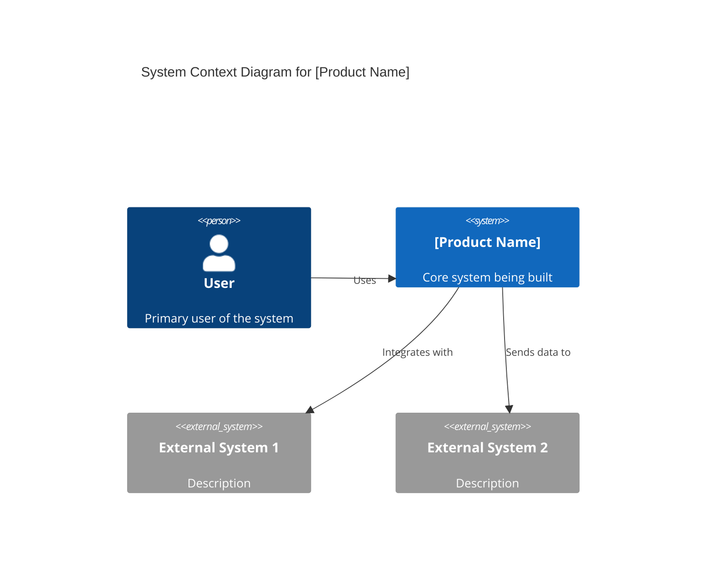
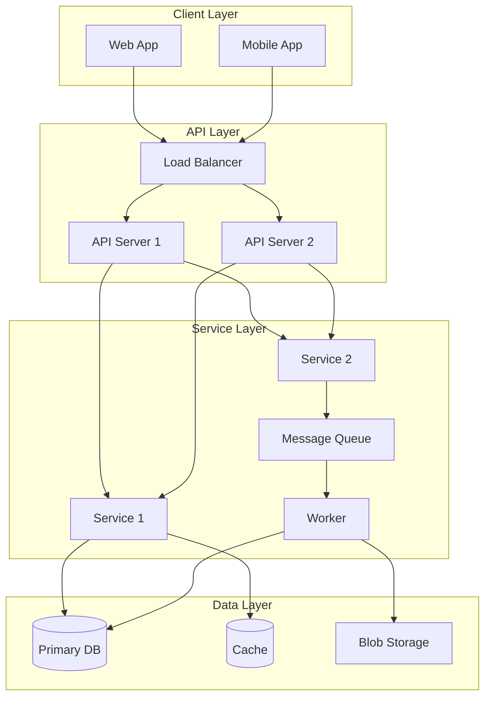
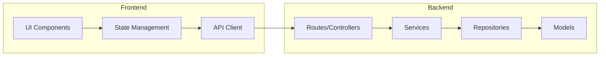
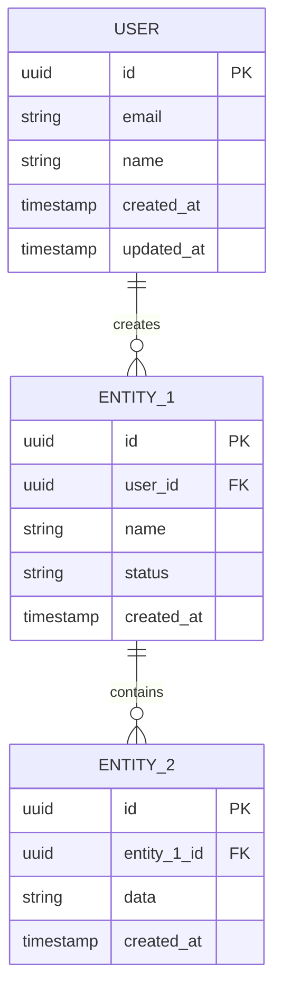
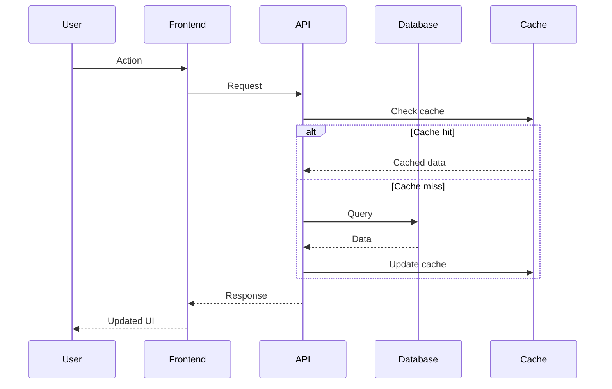
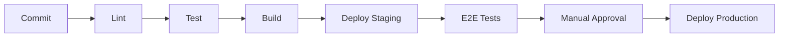

# ARD: [Product Name]

> **Status**: Draft | In Review | Approved  
> **Tech Lead**: [name]  
> **Date**: [YYYY-MM-DD]  
> **Last Updated**: [YYYY-MM-DD]

---

## Overview

| Field | Value |
|-------|-------|
| **PRD** | [Link to PRD.md](../2-definition/PRD.md) |
| **Tech Lead** | [Name] |
| **Reviewers** | [Names] |
| **Target Environment** | [Production / Staging / etc.] |

### Executive Summary

[2-3 sentence summary of the technical approach and key architectural decisions.]

---

## System Context

### Context Diagram



### System Boundaries

**In Scope**:
- [Component/functionality 1]
- [Component/functionality 2]
- [Component/functionality 3]

**Out of Scope**:
- [Component/functionality that exists elsewhere]
- [Functionality deferred to future phases]

---

## Architecture Decision Records (ADRs)

### ADR-001: [Decision Title]

| Field | Value |
|-------|-------|
| **Status** | Proposed | Accepted | Deprecated | Superseded |
| **Date** | [YYYY-MM-DD] |
| **Deciders** | [Names] |

**Context**:
[Describe the issue that motivated this decision. What problem are we solving?]

**Decision**:
[Describe the change or approach being proposed/adopted.]

**Options Considered**:

| Option | Pros | Cons |
|--------|------|------|
| Option A | [Pros] | [Cons] |
| Option B | [Pros] | [Cons] |
| Option C (Chosen) | [Pros] | [Cons] |

**Consequences**:
- [Positive consequence 1]
- [Positive consequence 2]
- [Negative consequence / tradeoff 1]
- [Risk or concern 1]

---

### ADR-002: [Decision Title]

| Field | Value |
|-------|-------|
| **Status** | Proposed | Accepted |
| **Date** | [YYYY-MM-DD] |
| **Deciders** | [Names] |

**Context**:
[Context for this decision]

**Decision**:
[The decision made]

**Consequences**:
- [Consequences]

---

### ADR-003: [Decision Title]

[Repeat pattern as needed]

---

## Tech Stack

| Layer | Technology | Version | Rationale |
|-------|------------|---------|-----------|
| **Frontend** | | | |
| Framework | [React/Vue/etc.] | [Version] | [Why chosen] |
| Styling | [Tailwind/CSS-in-JS/etc.] | [Version] | [Why chosen] |
| State Management | [Redux/Zustand/etc.] | [Version] | [Why chosen] |
| **Backend** | | | |
| Runtime | [Node/Python/Go/etc.] | [Version] | [Why chosen] |
| Framework | [Express/FastAPI/etc.] | [Version] | [Why chosen] |
| **Database** | | | |
| Primary | [PostgreSQL/MongoDB/etc.] | [Version] | [Why chosen] |
| Cache | [Redis/Memcached/etc.] | [Version] | [Why chosen] |
| **Infrastructure** | | | |
| Cloud | [AWS/GCP/Azure] | N/A | [Why chosen] |
| Compute | [ECS/Lambda/K8s/etc.] | N/A | [Why chosen] |
| CDN | [CloudFront/Cloudflare/etc.] | N/A | [Why chosen] |
| **DevOps** | | | |
| CI/CD | [GitHub Actions/CircleCI/etc.] | N/A | [Why chosen] |
| IaC | [Terraform/Pulumi/CDK/etc.] | [Version] | [Why chosen] |
| Monitoring | [Datadog/New Relic/etc.] | N/A | [Why chosen] |

---

## Architecture Diagrams

### High-Level Architecture



### Component Diagram



---

## Data Model

### Entity Relationship Diagram



### Key Entities

| Entity | Description | Storage | Retention |
|--------|-------------|---------|-----------|
| User | User accounts | PostgreSQL | Indefinite |
| [Entity 1] | [Description] | PostgreSQL | [Policy] |
| [Entity 2] | [Description] | PostgreSQL | [Policy] |
| [Audit Log] | System events | PostgreSQL | 90 days |
| [Session] | User sessions | Redis | 24 hours |

### Data Flow



---

## API Design

### API Overview

| Endpoint | Method | Description | Auth |
|----------|--------|-------------|------|
| `/api/v1/[resource]` | GET | List all | Required |
| `/api/v1/[resource]` | POST | Create new | Required |
| `/api/v1/[resource]/:id` | GET | Get by ID | Required |
| `/api/v1/[resource]/:id` | PUT | Update | Required |
| `/api/v1/[resource]/:id` | DELETE | Delete | Required |

### OpenAPI Specification

See [API_SPEC.yaml](./API_SPEC.yaml) for full OpenAPI specification.

### Authentication

| Method | Use Case | Details |
|--------|----------|---------|
| JWT | API authentication | [Details about implementation] |
| API Key | Service-to-service | [Details] |
| OAuth 2.0 | Third-party integrations | [Details] |

### Rate Limiting

| Tier | Requests/min | Burst |
|------|--------------|-------|
| Free | 60 | 10 |
| Pro | 300 | 50 |
| Enterprise | 1000 | 100 |

---

## Security Considerations

### Authentication & Authorization

- [ ] Authentication method: [JWT/OAuth/etc.]
- [ ] Authorization model: [RBAC/ABAC/etc.]
- [ ] Session management: [Details]
- [ ] Password policy: [Requirements]

### Data Protection

- [ ] Encryption at rest: [AES-256 / etc.]
- [ ] Encryption in transit: [TLS 1.3]
- [ ] PII handling: [Approach]
- [ ] Data masking: [Where applicable]

### Security Controls

| Control | Implementation | Status |
|---------|----------------|--------|
| Input validation | Server-side validation | ⬜ |
| SQL injection prevention | Parameterized queries | ⬜ |
| XSS prevention | Output encoding | ⬜ |
| CSRF protection | Token-based | ⬜ |
| Rate limiting | API gateway | ⬜ |
| Audit logging | All mutations | ⬜ |

### Compliance Requirements

- [ ] [GDPR / CCPA / HIPAA / SOC 2 / etc.]
- [ ] Data residency: [Requirements]
- [ ] Audit requirements: [Details]

---

## Scalability & Performance

### Performance Requirements

| Metric | Target | Measurement |
|--------|--------|-------------|
| Page load time | < 2s | P95 |
| API response time | < 200ms | P95 |
| Throughput | [X] req/s | Sustained |
| Concurrent users | [X] | Peak |

### Scaling Strategy

| Component | Strategy | Trigger |
|-----------|----------|---------|
| API servers | Horizontal auto-scale | CPU > 70% |
| Database | Read replicas | Connection count |
| Cache | Cluster mode | Memory usage |
| Workers | Queue-based scaling | Queue depth |

### Caching Strategy

| Data Type | Cache Location | TTL | Invalidation |
|-----------|----------------|-----|--------------|
| User sessions | Redis | 24h | On logout |
| API responses | Redis | 5m | On mutation |
| Static assets | CDN | 7d | On deploy |

---

## Reliability & Operations

### Availability Target

- **SLA**: [99.9% / 99.95% / etc.]
- **RTO** (Recovery Time Objective): [Time]
- **RPO** (Recovery Point Objective): [Time]

### Monitoring & Alerting

| Metric | Threshold | Alert |
|--------|-----------|-------|
| Error rate | > 1% | PagerDuty |
| Latency P95 | > 500ms | Slack |
| CPU usage | > 80% | Slack |
| Disk usage | > 85% | PagerDuty |

### Disaster Recovery

- [ ] Database backups: [Frequency]
- [ ] Multi-region: [Yes/No, details]
- [ ] Failover procedure: [Documented location]
- [ ] Recovery testing: [Frequency]

### Logging

| Log Type | Destination | Retention |
|----------|-------------|-----------|
| Application logs | [CloudWatch/etc.] | 30 days |
| Access logs | [S3/etc.] | 90 days |
| Audit logs | [Database] | 1 year |
| Error logs | [Sentry/etc.] | 30 days |

---

## Development & Deployment

### Repository Structure

```
[project-name]/
├── src/
│   ├── api/           # API routes
│   ├── services/      # Business logic
│   ├── models/        # Data models
│   ├── utils/         # Utilities
│   └── config/        # Configuration
├── tests/
│   ├── unit/
│   ├── integration/
│   └── e2e/
├── infra/             # IaC (Terraform/etc.)
├── docs/              # Documentation
└── scripts/           # Build/deploy scripts
```

### CI/CD Pipeline



### Environment Strategy

| Environment | Purpose | Deploy Trigger |
|-------------|---------|----------------|
| Local | Development | Manual |
| Dev | Integration testing | Push to `develop` |
| Staging | Pre-production validation | Push to `main` |
| Production | Live system | Manual approval |

---

## Milestones → Execution

### Development Phases

| Milestone | Features | Est. Complexity | Zeroshot Config | Target Date |
|-----------|----------|-----------------|-----------------|-------------|
| M1: Foundation | Infrastructure, Auth | STANDARD | standard.json | [Date] |
| M2: Core Features | F1, F2 | CRITICAL | critical.json | [Date] |
| M3: MVP Complete | F3, F4 | STANDARD | standard.json | [Date] |
| M4: Polish | UI refinement, testing | SIMPLE | simple.json | [Date] |

### Beads Task Generation

For each milestone, generate beads tasks following [BEADS_TASKS.md](../5-execution/BEADS_TASKS.md):

```
M1-foundation/
├── infra-setup.bead
├── auth-system.bead
├── database-schema.bead
└── ci-cd-pipeline.bead

M2-core-features/
├── feature-1.bead
├── feature-2.bead
└── ...
```

---

## Risks & Mitigations

| Risk | Likelihood | Impact | Mitigation |
|------|------------|--------|------------|
| [Technical risk 1] | Med | High | [Mitigation] |
| [Integration risk] | Low | High | [Mitigation] |
| [Scale risk] | Med | Med | [Mitigation] |

---

## Open Questions

- [ ] [Technical question 1] - Owner: [Name]
- [ ] [Technical question 2] - Owner: [Name]
- [ ] [Technical question 3] - Owner: [Name]

---

## Appendix

### Glossary

| Term | Definition |
|------|------------|
| [Term 1] | [Definition] |
| [Term 2] | [Definition] |

### References

- [Link to relevant documentation]
- [Link to design patterns used]
- [Link to similar implementations]

### Related Documents

- [PRD.md](../2-definition/PRD.md)
- [TECH_DESIGN.md](./TECH_DESIGN.md)
- [API_SPEC.yaml](./API_SPEC.yaml)

---

**Next Step**: Detail technical implementation in [TECH_DESIGN.md](./TECH_DESIGN.md) and generate execution tasks in [BEADS_TASKS.md](../5-execution/BEADS_TASKS.md)

