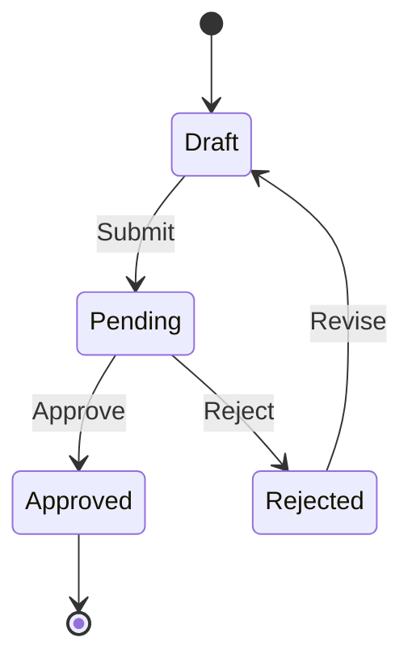

# Technical Design: [Product Name]

> **Status**: Draft | In Review | Approved  
> **Author**: [name]  
> **Date**: [YYYY-MM-DD]

---

## Overview

This document provides detailed technical specifications for implementing [Product Name], building on the high-level architecture defined in [ARD.md](./ARD.md).

---

## Module Specifications

### Module 1: [Module Name]

#### Purpose
[What this module does and why it exists]

#### Interface

```typescript
// TypeScript interface example
interface ModuleName {
  // Public methods
  methodOne(param: ParamType): ReturnType;
  methodTwo(param: ParamType): Promise<ReturnType>;
}
```

#### Dependencies
- [Dependency 1]: [Purpose]
- [Dependency 2]: [Purpose]

#### Implementation Notes
- [Key implementation detail 1]
- [Key implementation detail 2]
- [Edge case handling]

#### Error Handling
| Error Case | Response | Recovery |
|------------|----------|----------|
| [Error 1] | [HTTP code / Exception] | [Retry / Fail / etc.] |
| [Error 2] | [Response] | [Recovery strategy] |

---

### Module 2: [Module Name]

#### Purpose
[Description]

#### Interface

```python
# Python interface example
class ModuleName:
    def method_one(self, param: ParamType) -> ReturnType:
        """Description of method."""
        pass
    
    async def method_two(self, param: ParamType) -> ReturnType:
        """Async method description."""
        pass
```

#### Dependencies
- [List dependencies]

#### Implementation Notes
- [Notes]

---

### Module 3: [Module Name]

[Repeat pattern for each major module]

---

## Database Schema

### Tables

#### Table: `users`

```sql
CREATE TABLE users (
    id UUID PRIMARY KEY DEFAULT gen_random_uuid(),
    email VARCHAR(255) NOT NULL UNIQUE,
    password_hash VARCHAR(255) NOT NULL,
    name VARCHAR(255),
    role VARCHAR(50) DEFAULT 'user',
    status VARCHAR(50) DEFAULT 'active',
    email_verified_at TIMESTAMP,
    created_at TIMESTAMP DEFAULT CURRENT_TIMESTAMP,
    updated_at TIMESTAMP DEFAULT CURRENT_TIMESTAMP
);

CREATE INDEX idx_users_email ON users(email);
CREATE INDEX idx_users_status ON users(status);
```

| Column | Type | Constraints | Description |
|--------|------|-------------|-------------|
| id | UUID | PK | Unique identifier |
| email | VARCHAR(255) | NOT NULL, UNIQUE | User email |
| password_hash | VARCHAR(255) | NOT NULL | Bcrypt hash |
| name | VARCHAR(255) | | Display name |
| role | VARCHAR(50) | DEFAULT 'user' | User role |
| status | VARCHAR(50) | DEFAULT 'active' | Account status |
| email_verified_at | TIMESTAMP | | Verification timestamp |
| created_at | TIMESTAMP | DEFAULT NOW | Creation time |
| updated_at | TIMESTAMP | DEFAULT NOW | Last update |

---

#### Table: `[entity_1]`

```sql
CREATE TABLE [entity_1] (
    id UUID PRIMARY KEY DEFAULT gen_random_uuid(),
    user_id UUID NOT NULL REFERENCES users(id) ON DELETE CASCADE,
    name VARCHAR(255) NOT NULL,
    description TEXT,
    status VARCHAR(50) DEFAULT 'draft',
    metadata JSONB DEFAULT '{}',
    created_at TIMESTAMP DEFAULT CURRENT_TIMESTAMP,
    updated_at TIMESTAMP DEFAULT CURRENT_TIMESTAMP
);

CREATE INDEX idx_[entity_1]_user_id ON [entity_1](user_id);
CREATE INDEX idx_[entity_1]_status ON [entity_1](status);
CREATE INDEX idx_[entity_1]_created_at ON [entity_1](created_at DESC);
```

| Column | Type | Constraints | Description |
|--------|------|-------------|-------------|
| id | UUID | PK | Unique identifier |
| user_id | UUID | FK → users | Owner |
| name | VARCHAR(255) | NOT NULL | Name |
| description | TEXT | | Description |
| status | VARCHAR(50) | DEFAULT 'draft' | Status |
| metadata | JSONB | DEFAULT '{}' | Flexible metadata |
| created_at | TIMESTAMP | | Creation time |
| updated_at | TIMESTAMP | | Last update |

---

#### Table: `[entity_2]`

[Repeat pattern for each table]

---

### Migrations Strategy

```
migrations/
├── 001_create_users_table.sql
├── 002_create_entity_1_table.sql
├── 003_create_entity_2_table.sql
├── 004_add_indexes.sql
└── ...
```

**Migration Rules**:
1. Migrations are immutable once deployed
2. Always include both `up` and `down` scripts
3. Never modify data in structural migrations
4. Use separate migrations for data backfills

---

## API Endpoints Detail

### Authentication

#### POST `/api/v1/auth/register`

**Request**:
```json
{
  "email": "user@example.com",
  "password": "securePassword123",
  "name": "John Doe"
}
```

**Response** (201 Created):
```json
{
  "id": "uuid",
  "email": "user@example.com",
  "name": "John Doe",
  "created_at": "2024-01-01T00:00:00Z"
}
```

**Errors**:
| Code | Condition | Response |
|------|-----------|----------|
| 400 | Invalid email format | `{"error": "Invalid email format"}` |
| 400 | Weak password | `{"error": "Password must be at least 8 characters"}` |
| 409 | Email exists | `{"error": "Email already registered"}` |

---

#### POST `/api/v1/auth/login`

**Request**:
```json
{
  "email": "user@example.com",
  "password": "securePassword123"
}
```

**Response** (200 OK):
```json
{
  "access_token": "eyJhbG...",
  "refresh_token": "eyJhbG...",
  "expires_in": 3600,
  "token_type": "Bearer"
}
```

**Errors**:
| Code | Condition | Response |
|------|-----------|----------|
| 401 | Invalid credentials | `{"error": "Invalid email or password"}` |
| 403 | Account locked | `{"error": "Account locked"}` |

---

### Resource: [Entity 1]

#### GET `/api/v1/[entity_1]`

**Query Parameters**:
| Param | Type | Default | Description |
|-------|------|---------|-------------|
| page | int | 1 | Page number |
| limit | int | 20 | Items per page (max 100) |
| status | string | all | Filter by status |
| sort | string | created_at | Sort field |
| order | string | desc | Sort order (asc/desc) |

**Response** (200 OK):
```json
{
  "data": [
    {
      "id": "uuid",
      "name": "Item 1",
      "status": "active",
      "created_at": "2024-01-01T00:00:00Z"
    }
  ],
  "meta": {
    "page": 1,
    "limit": 20,
    "total": 100,
    "total_pages": 5
  }
}
```

---

#### POST `/api/v1/[entity_1]`

**Request**:
```json
{
  "name": "New Item",
  "description": "Description here",
  "metadata": {}
}
```

**Response** (201 Created):
```json
{
  "id": "uuid",
  "name": "New Item",
  "description": "Description here",
  "status": "draft",
  "metadata": {},
  "created_at": "2024-01-01T00:00:00Z"
}
```

**Validation**:
| Field | Rules |
|-------|-------|
| name | Required, 1-255 chars |
| description | Optional, max 10000 chars |
| metadata | Optional, valid JSON object |

---

#### GET `/api/v1/[entity_1]/:id`

**Response** (200 OK):
```json
{
  "id": "uuid",
  "name": "Item Name",
  "description": "Description",
  "status": "active",
  "metadata": {},
  "created_at": "2024-01-01T00:00:00Z",
  "updated_at": "2024-01-02T00:00:00Z"
}
```

**Errors**:
| Code | Condition |
|------|-----------|
| 404 | Not found |
| 403 | Not owner |

---

#### PUT `/api/v1/[entity_1]/:id`

**Request**:
```json
{
  "name": "Updated Name",
  "description": "Updated description",
  "status": "active"
}
```

**Response** (200 OK): Full updated object

---

#### DELETE `/api/v1/[entity_1]/:id`

**Response** (204 No Content)

---

## Business Logic

### Workflow: [Workflow Name]



**State Transitions**:
| From | To | Trigger | Validation |
|------|-----|---------|------------|
| Draft | Pending | User submits | All required fields filled |
| Pending | Approved | Admin approves | Passes review criteria |
| Pending | Rejected | Admin rejects | Reason required |
| Rejected | Draft | User revises | None |

**Side Effects**:
- Draft → Pending: Send notification to admins
- Pending → Approved: Send confirmation to user
- Pending → Rejected: Send rejection notice with reason

---

### Validation Rules

#### [Entity 1] Validation

```typescript
const entity1Schema = {
  name: {
    required: true,
    minLength: 1,
    maxLength: 255,
    pattern: /^[a-zA-Z0-9\s-]+$/
  },
  description: {
    required: false,
    maxLength: 10000
  },
  status: {
    required: true,
    enum: ['draft', 'pending', 'approved', 'rejected']
  }
};
```

#### Custom Validation Logic
- [Business rule 1]
- [Business rule 2]
- [Cross-field validation]

---

## Background Jobs

### Job: [Job Name]

| Property | Value |
|----------|-------|
| **Schedule** | Every 5 minutes / Daily at 00:00 UTC |
| **Queue** | default / high-priority |
| **Timeout** | 5 minutes |
| **Retries** | 3 |

**Purpose**: [What this job does]

**Logic**:
1. [Step 1]
2. [Step 2]
3. [Step 3]

**Error Handling**:
- On failure: [Retry / Alert / etc.]
- Dead letter queue: [Yes/No]

---

### Job: [Another Job Name]

[Repeat pattern]

---

## Third-Party Integrations

### Integration: [Service Name]

| Property | Value |
|----------|-------|
| **Provider** | [Company name] |
| **API Version** | [Version] |
| **Auth Method** | [API Key / OAuth / etc.] |
| **Rate Limit** | [X requests/minute] |

**Environment Variables**:
```
[SERVICE]_API_KEY=xxx
[SERVICE]_API_URL=https://api.service.com/v1
[SERVICE]_WEBHOOK_SECRET=xxx
```

**Usage**:
```typescript
// Example integration code
class ServiceClient {
  async doSomething(params: Params): Promise<Result> {
    // Implementation
  }
}
```

**Error Handling**:
| Error | Action |
|-------|--------|
| Rate limited | Exponential backoff |
| Auth failure | Alert, fail job |
| Timeout | Retry 3x |

---

## Configuration

### Environment Variables

| Variable | Required | Default | Description |
|----------|----------|---------|-------------|
| `NODE_ENV` | Yes | development | Environment |
| `DATABASE_URL` | Yes | - | Database connection string |
| `REDIS_URL` | Yes | - | Redis connection string |
| `JWT_SECRET` | Yes | - | JWT signing secret |
| `JWT_EXPIRES_IN` | No | 1h | JWT expiration |
| `LOG_LEVEL` | No | info | Logging level |

### Feature Flags

| Flag | Default | Description |
|------|---------|-------------|
| `FEATURE_X_ENABLED` | false | Enable feature X |
| `NEW_UI_ENABLED` | false | Enable new UI |

---

## Testing Strategy

### Unit Tests

| Module | Coverage Target | Notes |
|--------|-----------------|-------|
| Services | 90% | Business logic |
| Utils | 95% | Pure functions |
| Models | 80% | Validation |

### Integration Tests

| Flow | Priority | Notes |
|------|----------|-------|
| Auth flow | High | Register, login, logout |
| CRUD operations | High | All entities |
| Webhooks | Medium | Incoming/outgoing |

### E2E Tests

| Scenario | Priority |
|----------|----------|
| User signup to first action | High |
| Complete workflow | High |
| Error scenarios | Medium |

---

## Performance Considerations

### Query Optimization

| Query | Expected Volume | Optimization |
|-------|-----------------|--------------|
| List entities | 100/min | Index on user_id, status |
| Search | 50/min | Full-text index |
| Reports | 10/day | Materialized view |

### Caching Strategy

| Data | Cache Key | TTL | Invalidation |
|------|-----------|-----|--------------|
| User profile | `user:{id}` | 1h | On update |
| Entity list | `entities:{user_id}:{page}` | 5m | On create/update/delete |
| Config | `config:global` | 24h | Manual |

---

## Appendix

### Code Examples

#### Example: Service Implementation

```typescript
// src/services/entity1.service.ts
import { Entity1Repository } from '../repositories/entity1.repository';
import { CreateEntity1Dto, UpdateEntity1Dto } from '../dto/entity1.dto';

export class Entity1Service {
  constructor(private repository: Entity1Repository) {}

  async create(userId: string, data: CreateEntity1Dto) {
    // Validation
    this.validate(data);
    
    // Business logic
    const entity = await this.repository.create({
      ...data,
      userId,
      status: 'draft'
    });
    
    // Side effects
    await this.notifyCreated(entity);
    
    return entity;
  }

  async update(id: string, userId: string, data: UpdateEntity1Dto) {
    const entity = await this.repository.findById(id);
    
    if (!entity) throw new NotFoundError();
    if (entity.userId !== userId) throw new ForbiddenError();
    
    return this.repository.update(id, data);
  }
}
```

---

### Related Documents

- [ARD.md](./ARD.md)
- [API_SPEC.yaml](./API_SPEC.yaml)
- [PRD.md](../2-definition/PRD.md)

---

**Next Step**: Generate OpenAPI spec in [API_SPEC.yaml](./API_SPEC.yaml) and execution tasks in [BEADS_TASKS.md](../5-execution/BEADS_TASKS.md)

