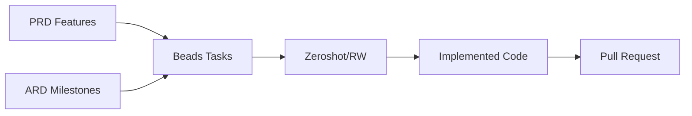

# Beads Task Generation Guide: [Product Name]

> **Status**: Ready for Execution  
> **Author**: [name]  
> **Date**: [YYYY-MM-DD]

---

## Overview

This document explains how to convert your PRD and ARD into structured tasks for autonomous execution via [Beads](https://github.com/steveyegge/beads) + [Zeroshot](https://github.com/covibes/zeroshot) or Ralph-Wiggum.

---

## Workflow Summary



---

## Task Generation Process

### Step 1: Extract Features from PRD

From your [PRD](../2-definition/PRD.md), list all features:

| Feature ID | Feature Name | Priority | User Stories |
|------------|--------------|----------|--------------|
| F1 | [Feature name] | P0 | US-001, US-002 |
| F2 | [Feature name] | P0 | US-003 |
| F3 | [Feature name] | P1 | US-004, US-005 |

### Step 2: Map to Milestones from ARD

From your [ARD](../4-architecture/ARD.md), map features to milestones:

| Milestone | Features | Complexity | Dependencies |
|-----------|----------|------------|--------------|
| M1: Foundation | Infrastructure | STANDARD | None |
| M2: Core | F1, F2 | CRITICAL | M1 |
| M3: MVP | F3, F4 | STANDARD | M2 |

### Step 3: Break Down into Beads Tasks

For each feature, create atomic, executable tasks:

```
[Product Name]/
├── M1-foundation/
│   ├── 001-project-scaffold.md
│   ├── 002-database-setup.md
│   ├── 003-auth-system.md
│   └── 004-ci-cd-pipeline.md
│
├── M2-core-features/
│   ├── 005-feature-1-backend.md
│   ├── 006-feature-1-frontend.md
│   ├── 007-feature-2-backend.md
│   └── 008-feature-2-frontend.md
│
└── M3-mvp-completion/
    ├── 009-feature-3.md
    ├── 010-feature-4.md
    └── 011-integration-tests.md
```

---

## Bead Task Template

Each bead should be a standalone, executable unit of work:

```markdown
# Task: [Descriptive Task Name]

## Context
- **Milestone**: M[X] - [Milestone Name]
- **Feature**: F[X] - [Feature Name]
- **Priority**: P0 | P1 | P2
- **Complexity**: TRIVIAL | SIMPLE | STANDARD | CRITICAL
- **Dependencies**: [List of prerequisite task IDs]

## Objective
[One clear sentence describing what this task accomplishes]

## Requirements
From PRD:
- [ ] [Requirement 1 from user story]
- [ ] [Requirement 2 from user story]

From ARD:
- [ ] [Technical requirement 1]
- [ ] [Technical requirement 2]

## Acceptance Criteria
- [ ] [Specific, testable criterion 1]
- [ ] [Specific, testable criterion 2]
- [ ] [Specific, testable criterion 3]

## Technical Specifications

### Files to Create/Modify
- `src/[path]/[file].[ext]` - [Purpose]
- `src/[path]/[file].[ext]` - [Purpose]

### Implementation Notes
- [Important technical detail 1]
- [Important technical detail 2]
- [Pattern to follow from existing code]

### API Contracts (if applicable)
```
[Relevant API endpoint or interface definition]
```

### Database Changes (if applicable)
```sql
-- Migration or schema changes
```

## Testing Requirements
- [ ] Unit tests for [component]
- [ ] Integration test for [flow]
- [ ] Test coverage target: [X]%

## Definition of Done
- [ ] Code implemented and compiles
- [ ] All acceptance criteria met
- [ ] Tests written and passing
- [ ] No linting errors
- [ ] Documentation updated (if needed)
```

---

## Complexity Guidelines

Map your tasks to Zeroshot complexity levels:

### TRIVIAL
- Single file changes
- No dependencies
- < 30 minutes of work
- Examples: Fix typo, update config, add comment

**Zeroshot behavior**: Single worker, no validators

### SIMPLE
- 2-3 files
- Minimal logic
- Clear requirements
- Examples: Add form field, new API endpoint wrapper

**Zeroshot behavior**: Single worker, generic validator

### STANDARD (Default)
- Multiple files
- Business logic
- Tests required
- Examples: New feature, refactoring, integration

**Zeroshot behavior**: Planner + workers, requirements + code validators

### CRITICAL
- System-wide impact
- Security implications
- Complex business logic
- Examples: Auth system, payment flow, data migration

**Zeroshot behavior**: Opus planner, multiple workers, all validators including security + adversarial

---

## Example Bead Tasks

### Example 1: TRIVIAL Task

```markdown
# Task: Add environment variable for feature flag

## Context
- **Milestone**: M1 - Foundation
- **Feature**: Configuration
- **Priority**: P0
- **Complexity**: TRIVIAL
- **Dependencies**: None

## Objective
Add FEATURE_X_ENABLED environment variable to configuration.

## Requirements
- [ ] Add env var to .env.example
- [ ] Add to config schema

## Acceptance Criteria
- [ ] .env.example contains FEATURE_X_ENABLED=false
- [ ] Config module exports featureXEnabled boolean

## Files to Create/Modify
- `.env.example` - Add new variable
- `src/config/index.ts` - Parse and export

## Definition of Done
- [ ] Variable added and documented
```

---

### Example 2: STANDARD Task

```markdown
# Task: Implement user registration endpoint

## Context
- **Milestone**: M1 - Foundation
- **Feature**: F1 - User Authentication
- **Priority**: P0
- **Complexity**: STANDARD
- **Dependencies**: 002-database-setup

## Objective
Create POST /api/v1/auth/register endpoint with email/password registration.

## Requirements
From PRD (US-001):
- [ ] Users can register with email and password
- [ ] Email must be unique
- [ ] Password must be at least 8 characters

From ARD:
- [ ] Use bcrypt for password hashing
- [ ] Return JWT tokens on successful registration
- [ ] Follow API spec in API_SPEC.yaml

## Acceptance Criteria
- [ ] POST /api/v1/auth/register accepts email, password, name
- [ ] Returns 201 with user object (no password) on success
- [ ] Returns 400 for validation errors
- [ ] Returns 409 for duplicate email
- [ ] Password is hashed with bcrypt (cost factor 12)
- [ ] User is created in database

## Technical Specifications

### Files to Create/Modify
- `src/routes/auth.routes.ts` - Add register route
- `src/controllers/auth.controller.ts` - Register handler
- `src/services/auth.service.ts` - Registration logic
- `src/dto/auth.dto.ts` - Request/response DTOs
- `tests/integration/auth.test.ts` - Integration tests

### API Contract
```yaml
POST /api/v1/auth/register
Request:
  - email: string (required, valid email)
  - password: string (required, min 8 chars)
  - name: string (required, 1-255 chars)
Response 201:
  - id: uuid
  - email: string
  - name: string
  - created_at: timestamp
```

### Implementation Notes
- Use class-validator for DTO validation
- Hash password before storing
- Return sanitized user (exclude password_hash)

## Testing Requirements
- [ ] Unit test for password hashing
- [ ] Integration test for successful registration
- [ ] Integration test for duplicate email
- [ ] Integration test for validation errors

## Definition of Done
- [ ] Endpoint responds correctly to valid requests
- [ ] All error cases handled
- [ ] Tests written and passing (>80% coverage)
- [ ] No linting errors
```

---

### Example 3: CRITICAL Task

```markdown
# Task: Implement JWT authentication middleware

## Context
- **Milestone**: M1 - Foundation
- **Feature**: F1 - User Authentication
- **Priority**: P0
- **Complexity**: CRITICAL
- **Dependencies**: 003-user-registration

## Objective
Create authentication middleware that validates JWT tokens and protects routes.

## Requirements
From PRD:
- [ ] All protected routes require valid JWT
- [ ] Invalid tokens return 401
- [ ] Expired tokens can be refreshed

From ARD (Security Section):
- [ ] Tokens signed with RS256
- [ ] Access token expires in 1 hour
- [ ] Refresh token expires in 7 days
- [ ] Token contains user ID and role

## Acceptance Criteria
- [ ] Middleware validates JWT signature
- [ ] Middleware validates token expiration
- [ ] Middleware extracts user from token and adds to request
- [ ] Returns 401 for missing token
- [ ] Returns 401 for invalid signature
- [ ] Returns 401 for expired token
- [ ] Refresh endpoint issues new access token

## Security Considerations
- [ ] Private key stored securely (env var, not in code)
- [ ] Token not logged in plaintext
- [ ] Refresh tokens stored in database for revocation
- [ ] Rate limiting on auth endpoints

## Technical Specifications

### Files to Create/Modify
- `src/middleware/auth.middleware.ts` - JWT validation
- `src/services/token.service.ts` - Token generation/validation
- `src/routes/auth.routes.ts` - Add refresh endpoint
- `src/models/refresh-token.model.ts` - Refresh token storage

### Implementation Notes
- Use jsonwebtoken library
- Store refresh tokens with user_id, token_hash, expires_at
- Implement token rotation on refresh

## Testing Requirements
- [ ] Unit tests for token generation
- [ ] Unit tests for token validation
- [ ] Integration test for protected route access
- [ ] Integration test for token refresh flow
- [ ] Security test for expired token rejection
- [ ] Security test for invalid signature rejection

## Definition of Done
- [ ] Middleware protects routes correctly
- [ ] All security scenarios tested
- [ ] No tokens or secrets in logs
- [ ] Tests passing (>90% coverage for auth code)
- [ ] Security review completed
```

---

## Zeroshot Configuration

### Config Files

Create cluster configs for different complexity levels:

**`configs/trivial.json`**:
```json
{
  "complexity": "TRIVIAL",
  "agents": 1,
  "validators": []
}
```

**`configs/simple.json`**:
```json
{
  "complexity": "SIMPLE",
  "agents": 2,
  "validators": ["generic"]
}
```

**`configs/standard.json`**:
```json
{
  "complexity": "STANDARD",
  "agents": 4,
  "validators": ["requirements", "code"]
}
```

**`configs/critical.json`**:
```json
{
  "complexity": "CRITICAL",
  "agents": 7,
  "validators": ["requirements", "code", "security", "tester", "adversarial"],
  "planner_model": "opus"
}
```

### Running Tasks

```bash
# Run a single task
zeroshot run --config configs/standard.json --issue <github-issue-number>

# Run with specific bead file
zeroshot run --config configs/standard.json --bead M2-core-features/005-feature-1-backend.md

# Run with PR creation
zeroshot run --config configs/standard.json --pr --bead M2-core-features/005-feature-1-backend.md
```

---

## Task Ordering

Execute tasks in dependency order:

```
Phase 1: Foundation (M1)
  1. 001-project-scaffold (SIMPLE)
  2. 002-database-setup (STANDARD)
  3. 003-auth-system (CRITICAL)
  4. 004-ci-cd-pipeline (STANDARD)

Phase 2: Core Features (M2)
  5. 005-feature-1-backend (STANDARD) [depends: 1,2,3]
  6. 006-feature-1-frontend (STANDARD) [depends: 5]
  7. 007-feature-2-backend (STANDARD) [depends: 1,2,3]
  8. 008-feature-2-frontend (STANDARD) [depends: 7]

Phase 3: MVP (M3)
  9. 009-feature-3 (SIMPLE) [depends: 5-8]
  10. 010-feature-4 (SIMPLE) [depends: 5-8]
  11. 011-integration-tests (STANDARD) [depends: all]
```

---

## Checklist Before Execution

Before running zeroshot on a task:

- [ ] PRD is approved
- [ ] ARD is approved
- [ ] Task has clear acceptance criteria
- [ ] Dependencies are completed
- [ ] Repository is set up
- [ ] CI/CD is configured
- [ ] Correct complexity level assigned

---

## Monitoring & Iteration

### During Execution
- Monitor zeroshot logs: `zeroshot logs <cluster-id>`
- Check validator feedback
- Resume if interrupted: `zeroshot resume <cluster-id>`

### After Completion
- Review generated PR
- Run manual testing if needed
- Merge or request changes
- Mark bead as complete

### Iteration
If task fails or needs changes:
1. Update bead with clarified requirements
2. Re-run with same config
3. Document learnings for future tasks

---

## Related Documents

- [PRD.md](../2-definition/PRD.md)
- [ARD.md](../4-architecture/ARD.md)
- [ZEROSHOT_CONFIG.md](./ZEROSHOT_CONFIG.md)

---

**Next Step**: Generate individual bead files for your project and begin execution

